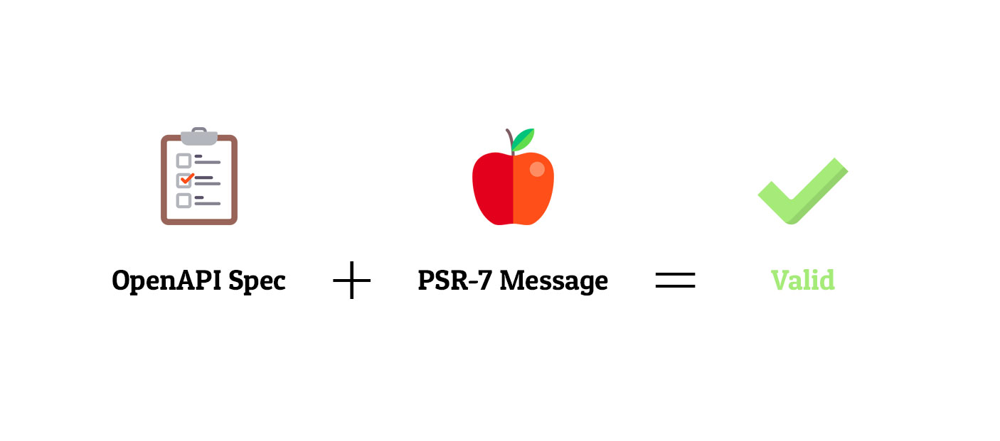

[](https://packagist.org/packages/lezhnev74/openapi-psr7-validator)
[](https://travis-ci.org/lezhnev74/openapi-psr7-validator)
[](https://packagist.org/packages/lezhnev74/openapi-psr7-validator)
[](https://packagist.org/packages/lezhnev74/openapi-psr7-validator)

# OpenAPI PSR-7 Message (HTTP Request/Response) Validator
This package can validate PSR-7 messages against OpenAPI (3.0.2) specifications 
expressed in YAML or JSON. 



## Requirements
n/a

## Installation
```
composer require lezhnev74/openapi-psr7-validator
```

## OpenAPI (OAS) Terms
There are some specific terms that are used in the package. These terms come 
from OAS 3 specification:
- `specification` - an OAS data expressed in JSON or YAML file
- `data` - actual thing that we validate against a specification
- `schema` - data type specification
- `keyword` - properties that are used to describe the instance are called key
words, or schema keywords
- `path` - a relative path to an individual endpoint
- `operation` - a method that we apply on the path (like `get /password`)
- `response` - described response (includes status code, content types etc)


## How To Validate

### ServerRequest Message
You can validate `\Psr\Http\Message\ServerRequestInterface` instance like this:
```php
$yamlFile = "api.yaml";

$validator = new \OpenAPIValidation\PSR7\ServerRequestValidator(
    \cebe\openapi\Reader::readFromYamlFile($yamlFile)
);

$validator->validate($request);
```

### Response Message
Validation of `\Psr\Http\Message\ResponseInterface` is a bit more complicated
. Because you need not only YAML file and Response itself, but also you need 
to know which operation this response belongs to (in terms of OAS).

Example:
```php
$yamlFile = "api.yaml";
$operation = new \OpenAPIValidation\PSR7\OperationAddress('/password/gen', 
'get') 

$validator = new \OpenAPIValidation\PSR7\ResponseValidator(
    $operation,
    \cebe\openapi\Reader::readFromYamlFile($yamlFile)
);

$validator->validate($request);
```

### Request Message
`\Psr\Http\Message\RequestInterface` validation is not implemented. 

### PSR-15 Middleware
PSR-15 middleware can be used like this:
```php
$yamlFile = "api.yaml";
$jsonFile = "api.yaml";

$middleware = \OpenAPIValidation\PSR15\ValidationMiddleware::fromYamlSpec($specYaml);
# or
$middleware = \OpenAPIValidation\PSR15\ValidationMiddleware::fromJsonSpec($jsonYaml);
```

### SlimFramework middleware
Slim framework uses slightly different middleware interface, so here is an 
adapter which you can use like this:
```php
PSR-15 middleware can be used like this:
```php
$yamlFile = "api.yaml";
$psr15Middleware = \OpenAPIValidation\PSR15\ValidationMiddleware::fromYamlSpec
($specYaml);

$slimMiddleware = new \OpenAPIValidation\PSR15\SlimAdapter($psr15Middleware);

/** @var \Slim\App $app */
$app->add($slimMiddleware);
```

### Standalone OpenAPI Validator
The package contains a standalone validator which can validate any data 
against an OpenAPI schema like this:
```php
$spec = <<<SPEC
schema:
  type: string
  enum:
  - a
  - b
SPEC;
$data = "a";

$spec   = cebe\openapi\Reader::readFromYaml($spec);
$schema = new cebe\openapi\spec\Schema($spec->schema);
(new OpenAPIValidation\Schema\Validator($schema, $data))->validate();
```

## Custom Type Formats
As you know, OAS allows you to add formats to types:
```yaml
schema:
  type: string
  format: binary
```
This package contains a bunch of built-in format validators:
- `string` type:
    - `byte`
    - `date`
    - `date-time`
    - `email`
    - `hostname`
    - `ipv4`
    - `ipv6`
    - `uri`
    - `uuid` (uuid4)
- `number` type
    - `float`
    - `double`

You can also add your own formats. Like this:
```php
# A format validator can be a callable
# failed validation should throw an exception
$customFormat = new class()
{
    function __invoke($value): void
    {
        if ($value != "good value") {
            throw FormatMismatch::fromFormat('custom', $value);
        }
    }
};

# Register your callable like this before validating tyour data
\OpenAPIValidation\Schema\TypeFormats\FormatsContainer::registerFormat('string', 'unexpected', $unexpectedFormat);
```

## Exceptions
The package throws a list of various exceptions which you can catch and 
handle. There are some of them:
- Schema related:
    - `\OpenAPIValidation\Schema\Exception\ValidationKeywordFailed` - data does 
    not match given keyword's rule. For example `type:string` won't match integer 
    `12`.
    - `\OpenAPIValidation\Schema\Exception\FormatMismatch` - data mismatched a 
    given type format. For example `type: string, format: email` won't match 
    `not-email`.
    - `\OpenAPIValidation\Schema\Exception\DataMismatched` - in general, data 
    does not match a given schema specification
- PSR7 Messages related:
    - `\OpenAPIValidation\PSR7\Exception\NoContentType` - Response contains 
    no Content-Type header. General HTTP errors.
    - `\OpenAPIValidation\PSR7\Exception\NoPath` - path is not found in the spec
    - `\OpenAPIValidation\PSR7\Exception\NoOperation` - operation os not 
    found in the path
    - `\OpenAPIValidation\PSR7\Exception\NoResponseCode` - response code not 
    found under the operation in the spec
    - Request related:
        - `\OpenAPIValidation\PSR7\Exception
        \MultipleOperationsMismatchForRequest` - request matched multiple 
        operations in the spec, but validation failed for all of them.
        - `\OpenAPIValidation\PSR7\Exception\MissedRequestCookie` - Request 
        does not contain expected cookie
        - `\OpenAPIValidation\PSR7\Exception\MissedRequestHeader` - Request 
        dons not contain expected header
        - `\OpenAPIValidation\PSR7\Exception\MissedRequestQueryArgument` - 
        Request does not have expected query argument
        - `\OpenAPIValidation\PSR7\Exception\RequestBodyMismatch` - request's
         body does not match the specification schema
        - `\OpenAPIValidation\PSR7\Exception\RequestCookiesMismatch` - 
        request's cookie does not match the specification schema
        - `\OpenAPIValidation\PSR7\Exception\RequestHeadersMismatch` - 
        request's headers do not match spec schema
        - `\OpenAPIValidation\PSR7\Exception\RequestPathParameterMismatch` - 
        request's path does not match spec's path template
        - `\OpenAPIValidation\PSR7\Exception\RequestQueryArgumentMismatch` - 
        request's query arguments does not match the spec schema
        - `\OpenAPIValidation\PSR7\Exception\UnexpectedRequestContentType` - 
        request's body content type is unexpected
        - `\OpenAPIValidation\PSR7\Exception\UnexpectedRequestHeader` - 
        request carries unexpected header  
    - Response related:
        - `\OpenAPIValidation\PSR7\Exception\MissedResponseHeader` - response
         does not have a header
        - `\OpenAPIValidation\PSR7\Exception\ResponseBodyMismatch` - response
         body does not match a schema
        - `\OpenAPIValidation\PSR7\Exception\ResponseHeadersMismatch` - 
        response headers do not match the spec
        - `\OpenAPIValidation\PSR7\Exception\UnexpectedResponseHeader` - 
        response contains header not mentioned in the spec
        - `\OpenAPIValidation\PSR7\Exception\UnexpectedResponseContentType` -
         response contains unexpected content-type 


## Testing
You can run the tests with:

```
vendor/bin/phpunit
```

## Credits
People:
- [Dmitry Lezhnev](https://github.com/lezhnev74)
- A big thank you to [Henrik Karlström](https://github.com/hkarlstrom) who kind of inspired me to work on this package. 

Resources:
- Icons made by Freepik, licensed by CC 3.0 BY
- [cebe/php-openapi](https://github.com/cebe/php-openapi) package for Reading OAS files
- [slim3-psr15](https://github.com/bnf/slim3-psr15) package for Slim middleware adapter
 
## License
The MIT License (MIT). Please see `License.md` file for more information.

## TODO
- [ ] parameters serialization
    - Does anyone use this serialization? It looks very... unpractical.
- [ ] add validation for Request class.
    - Usually for serverside testing purposes ServerRequest is what we need. 
    But, Request should be quite easy to add.